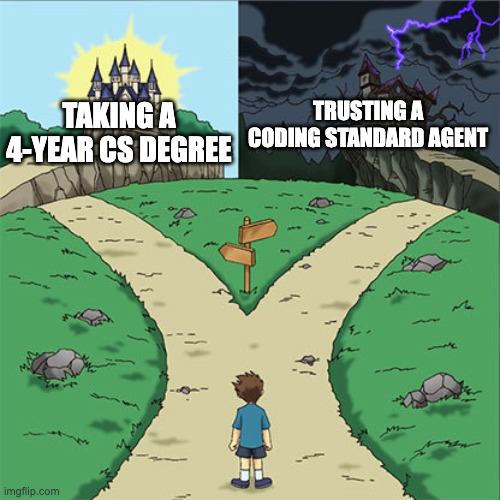

<div align="center">



# 🧠 Cook

__Optimising the vibe in vibecoding.__

You've got brilliant ideas (that definitely are original and unique). You set up Claude Code, crack your joints, and fire up your favourite IDE (VSCode). You ask Claude, politely, to write the code for this feature that you believe is game-changing. 

*But wait, how do you know that Claude is writing... right?*

With little to zero software engineering knowledge, expertise, and skills, you can now outsource the blood, sweat, and tears of learning discrete mathematics, algorithms, and programming languages to this simple skill: `/cook`. Now, your coding agent can write the highest-quality code.

</div>

___

`cook` is the knowledge layer. Before your coding agent starts planning or writing code changes, ask it to fire up `cook`. The skill checks your codebase, searches the most relevant coding references, compresses them, and outputs to your coding agent ready to be used.

Every run is saved — if the code changes are on the same programming languages, matches file extensions (e.g. `.tsx`), or similar tpyes (e.g. creating a component), `cook` won't call the entire library of references again but simply refers to a cache of existing runs so it's faster and cheaper.

## Installation

Run this in your terminal:

```bash
curl -fsSL https://raw.githubusercontent.com/ndisisnd/cook/main/install.sh | bash
```

This installs cook to `~/.claude/skills/cook/`. To install somewhere else:

```bash
COOK_DIR=/path/to/destination bash install.sh
```

**Requirements:** `curl`, `python3`

## How it Works

1. **Ask your coding agent to invoke `/cook`:** `cook` will check file paths, prose descriptions, git context.
2. **Build a fingerprint:** the raw signals are hashed and checked against the cache. A match skips classification entirely — straight to compile.
3. **Classify intent:** if it's a miss, `cook` classifies the intent (e.g. "add a feature" vs. "fix a bug"), then routes to the relevant domain and concern standards.
4. **Load global rules**: Global rules are always loaded first (e.g. SOLID principles, DRY, security) — no exceptions, regardless of cache state.
5. **Load concern rules**: Concern rules are cross-cutting rules like security, error handling, performance, and API design. 
6. **Load domain rules**: Domain rules for your programming language are loaded. Multiple domains can match at once.
7. **Cache the result**: Routing decisions are written to cache so the next identical surface hits instantly. 
8. **Compile and output**: A Python compiler stitches all the loaded rule files into one markdown blob for your agent to ingest. `cook` ends here!

### Usage

You can invoke `/cook` with explicit flags or prose to control exactly what gets loaded.

#### Flags

The `--flag` namespace is derived from `vocab/tag-vocabulary.json` and may grow as the vocabulary grows. Treat this list as a snapshot; the vocab file is the source of truth.

**Shelf (1):** `--global` — loads `standards/global/SKILL.md` + all 8 concern refs (P0 + full concern set). Use when you want the global floor without auto-detection.

**Concerns (8):** `--security`, `--auth`, `--performance`, `--architecture`, `--api-design`, `--error-handling`, `--debug`, `--cicd` — each loads one ref from `standards/global/refs/`; no P0.

**Domains (9):** `--react`, `--nextjs`, `--flutter`, `--dart`, `--typescript`, `--nodejs`, `--database`, `--supabase`, `--graphql` — loads the full domain shelf (SKILL.md + all refs).

**Sub-ref flags:** `--<domain>:<ref>` loads a single ref from a domain shelf without loading the domain SKILL.md. The `ref` is a file stem under `standards/<domain>/refs/`. Combine with the domain flag to load both: `--react --react:hooks`.

#### Examples

| Invocation | What loads |
|---|---|
| `/cook` | Auto-detect from git + manifests; loads global P0 + matched concerns + matched domains |
| `/cook --global` | `standards/global/SKILL.md` + all 8 concern refs; no auto-detection |
| `/cook --security` | `standards/global/refs/security.md` only; no P0 |
| `/cook --react --nextjs` | Both shelves in full; no P0 |
| `/cook --react:hooks` | `standards/react/refs/hooks.md` only; no SKILL.md, no P0 |
| `/cook --react --react:hooks` | `standards/react/SKILL.md` + `standards/react/refs/hooks.md` only |
| `/cook --react fix re-renders in the dashboard` | `standards/react/SKILL.md` + only the refs the LLM picks from `react/_INDEX.md`; no P0, no cache |
| `/cook refactor the OAuth callback` | LLM scans every `_INDEX.md` and loads matching refs across the whole library; no P0, no cache |
| `/cook --notarealflag` | Error — non-zero exit, usage printed with the full valid flag list, nothing loaded |

**P0 trade-off:** any explicit flag or prose argument skips the global P0 floor — the contract is "load exactly what I named." Use `--global` to opt back in explicitly. Default `/cook` keeps the floor.

## Available Standards

| Standards | What's covered | 
| --- | --- |
| Global | Universal rules loaded on every task: architecture, API design, error handling, security, auth, performance, debugging, and CI/CD |
| Dart | Language correctness, sealed/record/pattern matching, async, naming conventions, tooling (build_runner, dart format), and testing (mocktail, fake_async) |
| Database | PostgreSQL schema design, expand-contract migrations, query optimisation, indexing, RLS, and Redis caching strategy (TTL, eviction, pipeline safety) |
| Flutter | Widget best practices, state management (Bloc/Riverpod/GetX), navigation (GoRouter), architecture (feature-domain), networking (Dio), error handling (Either/dartz), and DI (GetIt) |
| GraphQL | Schema design, resolver patterns, security (depth/complexity limits), performance (DataLoader, N+1 prevention), testing, and tooling (codegen, graphql-eslint) |
| Next.js | App Router and Pages Router, Server/Client Components, data fetching, rendering and caching strategies, Server Actions, security, performance, and testing |
| Node.js | Runtime safety, event loop, streams, backpressure, worker threads, graceful shutdown, async error handling, env validation, logging, and testing |
| React | Component patterns, hooks, state management (Zustand/Redux/TanStack), performance (Suspense, lazy), security (XSS/CSP), testing (RTL/MSW), and tooling |
| Supabase | RLS policies (auth.uid/auth.jwt), anon vs service_role key boundary, Edge Functions (Deno, verify_jwt), Postgres functions (SECURITY DEFINER/INVOKER), and migration workflow |
| TypeScript | Type safety, generics, unions, interfaces, ESLint configuration, jest/vitest setup, and input validation patterns |

## FAQ
